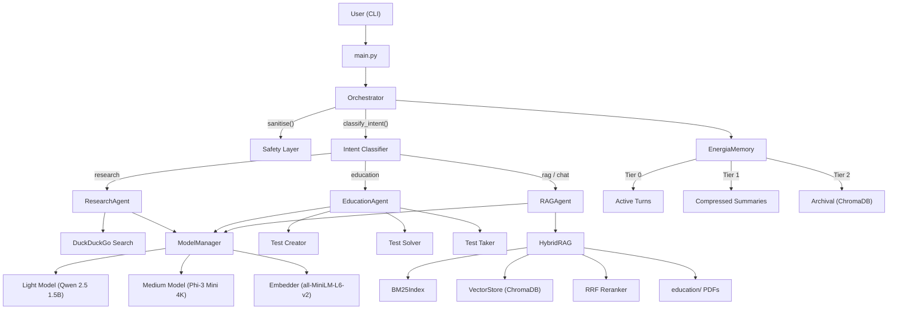

# ANTIMONY — Project Description

## Overview

**ANTIMONY** is a **fully offline, multi-agent AI assistant** built in Python, designed primarily as an **educational companion for 8th-grade students** following the Romanian national curriculum. It runs local quantized LLMs via `llama-cpp-python`, performs Retrieval-Augmented Generation (RAG) over PDF/RTF textbooks, can research the web via DuckDuckGo, and includes tools for generating, solving, and interactively taking tests — all with multilingual support (English, Romanian, Russian).

The system is architected to run on **resource-constrained hardware** (specifically Raspberry Pi 5 and Apple Silicon Macs) while providing a rich, agentic experience through an intent-routing orchestrator, a three-tier memory system, and a hybrid retrieval pipeline.

---

## Architecture

---

## Modules

### Entry Point — `main.py`

CLI interface with two modes:
* **Interactive REPL** — ASCII banner, slash commands (`/help`, `/clear`, `/memory`, `/exit`)
* **Single-query mode** — `--query "…"` with optional `--json` output

### Configuration — `config.py`

Auto-detects hardware platform and sets parameters accordingly:

| Parameter | Description |
| :--- | :--- |
| `IS_MAC_M1` / `IS_PI5` / `IS_X86` | Hardware detection flags |
| `LIGHT_MODEL` | Qwen 2.5 1.5B (Q4_K_M) — fast classification & summarisation |
| `MEDIUM_MODEL` | Phi-3 Mini 4K (Q4_K_M) — main generation model |
| `EMBED_MODEL` | `all-MiniLM-L6-v2` — sentence embeddings |
| `N_GPU_LAYERS` | `-1` (full offload) on Mac M1, `0` on others |
| `CONFIDENCE_THRESHOLD` | `0.55` — below this triggers a low-confidence warning |

---

### `agents/` — Multi-Agent System

#### `orchestrator.py`
Central router that:
1.  **Sanitises** input via the safety layer
2.  **Classifies intent** — regex pattern matching → light-model fallback
3.  **Dispatches** to the correct agent (`RAGAgent`, `ResearchAgent`, `EducationAgent`)
4.  **Persists** the exchange to memory

#### `base_agent.py`
Abstract base class providing shared `_build_prompt()` with ChatML formatting and memory injection.

#### `rag_agent.py`
Default/chat agent — retrieves top-6 chunks from HybridRAG, answers using the medium model with source citations (`[N]` notation), and reports confidence.

#### `research_agent.py`
Web research pipeline:
1.  **Query expansion** — light model generates 2 alternative search queries
2.  **DuckDuckGo search** — up to 3 iterations, 8 results each, with rate limiting
3.  **Deduplication** — prefix-based snippet dedup
4.  **Synthesis** — medium model produces a cited answer
5.  **Clarification** — optionally prompts a clarifying question for complex goals

#### `education_agent.py`
Routes educational requests to specialised tools:
* **Create** → `test_creator` — generates formatted tests from textbook context
* **Solve** → `test_solver` — produces answer sheets with explanations
* **Take** → `test_taker` — runs interactive quiz sessions with grading
* **Fallback** → RAG-based educational Q&A

---

### `core/` — Infrastructure

#### `model_manager.py`
Thread-safe, lazy-loading singleton (`models`) managing three models. Supports streaming, GPU offloading on Apple Silicon, and explicit memory reclamation (`unload_medium()`) for low-RAM devices.

#### `memoria.py`
Three-tier conversational memory system (`EnergiaMemory`):

| Tier | Name | Storage | Mechanism |
| :--- | :--- | :--- | :--- |
| 0 | Active | In-memory list | Last 6 turns verbatim |
| 1 | Warm | In-memory summaries | Light model compresses oldest 4 turns |
| 2 | Cold/Archival | ChromaDB | Embedding-indexed, cosine similarity gate ($\geq 0.72$) |

#### `safety.py`
* **Prompt injection detection** — 10 regex patterns for common jailbreak/injection techniques
* **Tag stripping** — removes ChatML/system tags from user input
* **Input truncation** — caps at 4000 chars
* **Confidence scoring** — converts mean token log-probabilities to a normalized $[0, 1]$ score

---

### `rag/` — Hybrid Retrieval Pipeline

| File | Role |
| :--- | :--- |
| `hybrid_rag.py` | Orchestrates ingestion (400-word chunks, 80-word overlap) and dual-retrieval |
| `bm25_index.py` | Lexical search via BM25Okapi with multilingual stopwords (EN/RO/RU) |
| `vector_store.py` | Dense retrieval via ChromaDB + sentence-transformer embeddings |
| `reranker.py` | Reciprocal Rank Fusion (RRF, k=60) to merge BM25 + dense results |

Automatically ingests all PDF/RTF files from the educational directory on startup.

---

### `tools/` — Educational Tooling
* **Test Creator:** Generates structured tests (MCQ/short/mixed) in the "ANTIMONY TEST FORMAT" with answer keys; multilingual (EN/RO/RU).
* **Test Solver:** Solves any test with reasoning and justification via RAG-augmented generation.
* **Test Taker:** Interactive quiz session — presents questions, collects answers, grades via medium model.

---

### `education/` — Knowledge Corpus

Eight 8th-grade Romanian curriculum textbooks (PDF):
* Biology (2024), Chemistry (2020), Physics (2024)
* Geography (2024), History (2024)
* Computer Science (2020)
* Romanian Language & Literature (2025, allophone edition)
* Mathematics (2023)

Total corpus size: **~156 MB** of PDF content.

---

### `models/` — Local LLMs

| Model | File Size | Role |
| :--- | :--- | :--- |
| Qwen 2.5 1.5B Instruct | ~1.0 GB | Light (classification, summarisation, query expansion) |
| Phi-3 Mini 4K Instruct | ~2.2 GB | Medium (generation, test creation, grading) |

---

## Key Design Decisions

* **Fully offline-capable** — no cloud APIs required; web search is optional.
* **Hardware-aware** — auto-adapts GPU offloading, model paths, and memory strategy per platform.
* **Privacy by design** — all inference, embeddings, and storage are local.
* **Multilingual** — intent patterns, test generation, and tokenisation support EN/RO/RU.
* **Confidence transparency** — every response includes a confidence score derived from token log-probabilities, with explicit low-confidence warnings.
* **Safety-first** — prompt injection detection and input sanitisation at the orchestrator entry point.
